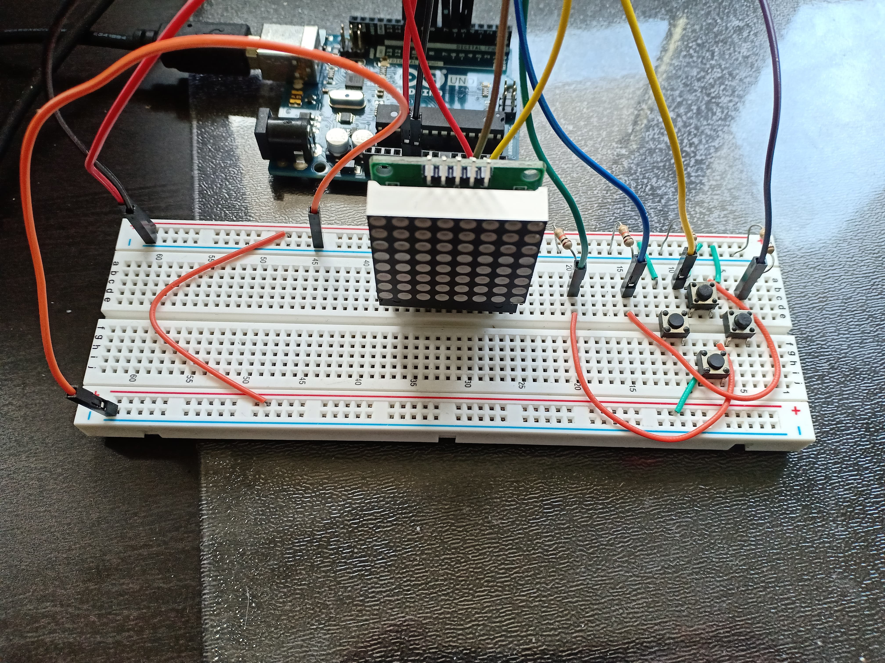
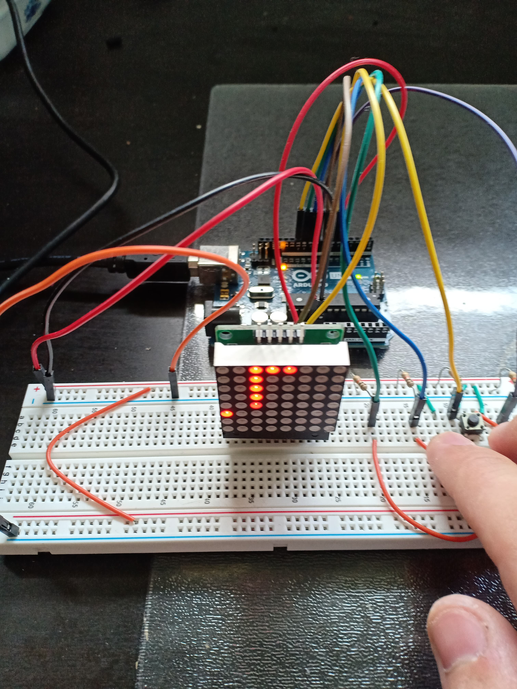

# Arduino Snake

A snake game made with an arduino uno, a 8x8 led matrix and 4 push buttons

## Pinout

Like described in src/constants.h

```c
// Pins matrix
#define PIN_CLK_MATRIX (5)
#define PIN_CS_MATRIX (6)
#define PIN_DIN_MATRIX (7)

// Pins for the buttons
#define PIN_BUTTON_RIGHT (8)
#define PIN_BUTTON_UP (9)
#define PIN_BUTTON_DOWN (10)
#define PIN_BUTTON_LEFT (11)
```

## Build

- Install [PlatformIO](https://platformio.org/)

```
$ make
```

## Flash

```
$ make flash
```

## What it looks like




## Licence
This project is licensed under the terms of the MIT license.
